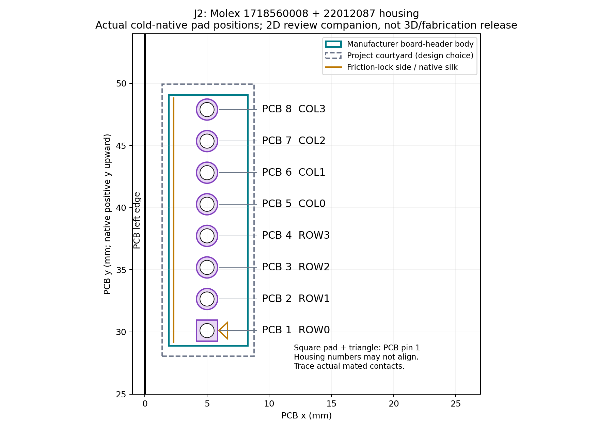
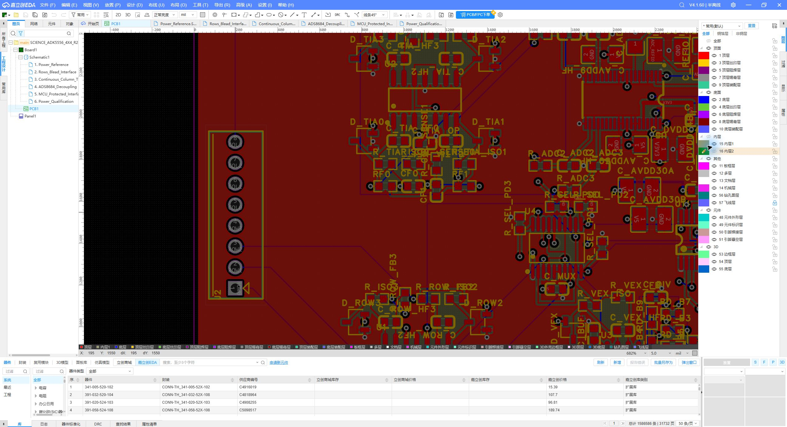

# R17 J2单排8位可插拔接口 — 工程审查版

[完整回执](COMPLETE_J2_INTERFACE_RECEIPT.md) · [接口和配套选料](J2_CONNECTOR_AND_HARNESS_SPEC.md) · [针序和方向](J2_PINOUT_AND_KEYING.md) · [实际8针CSV](J2_ACTUAL_8PIN_HARNESS.csv) · [制造合同](FABRICATION_INPUT_CONTRACT.md) · [41项矩阵](MANUFACTURING_PREFLIGHT_MATRIX.csv)

Molex1718560008板端+22012087线端壳体；actual8孔/ROWCOL/warm+coldDRC四类0；其它175与主铜不变。原生ROW/COL文字未印，17号丝印conformance HOLD（配套图/CSV强制随附，不能当实际丝印）。准确端子按实际线径待定，未知现有线束兼容、全3D和制造未放行。原生genericdevice/3D保留，必须随[J2配套装配覆盖合同](J2_CONNECTOR_AND_HARNESS_SPEC.md)，不按genericcatalog选料。

实际File SCIENCE_ADK5556_4X4_R21_J2_PLUGGABLE_REVIEW.epro2；完整eprj2源工程、实际550padnetCSV/176BOMCSV、warm/cold全source、DRC/资格/失败回执直接交付。原生body/孔参数以actualFile源确认，不冒称metadata自动BOM或3D全资格。publicSHAmanifest与ZIP另生成。厂家整PDF/全页PNG/大段extract本地存证不公开复刻，仅官方/镜像链接、边界短说明与SHA。
