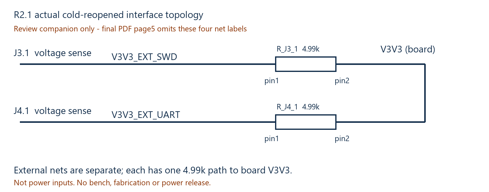

# Actual interface topology companion — review only

This readable companion is required with final native/PDF. Page5 has four empty arrows without printed new net names; actual cold-reopened netlist has the correct independent networks. This companion does not alter or replace the native evidence.

```text
J3.1 -- V3V3_EXT_SWD  -- R_J3_1.1 [4.99k] R_J3_1.2 -- V3V3 (board)
J4.1 -- V3V3_EXT_UART -- R_J4_1.1 [4.99k] R_J4_1.2 -- V3V3 (board)
```

The external-side pins are different nets; there is no direct external-side connection. The two resistors share only their board-side V3V3. They are no longer two parallel resistors between the same pair of nets. This is a topology statement, not a measured fault-protection claim. J3.1 and J4.1 are voltage-sense interfaces, not power inputs or auxiliary power outputs.

| Cold actual net | Complete members |
|---|---|
| V3V3_EXT_SWD | J3-1, R_J3_1-1 |
| V3V3_EXT_UART | J4-1, R_J4_1-1 |

Both MPNs remain RT0603BRD074K99L /4.99k 0.1% /R0603; resistor pin2 remains V3V3. Exactly these four connected pins changed from09; remaining510, all36NC and176 core component dictionaries/coordinates unchanged. See FUNCTIONAL_INTERFACE_SPLIT_CHECK.json, FINAL_514_PIN_NET_CHECKS.csv, FINAL_107_NETWORK_MEMBERS.csv and COLD_REOPEN_COMPARE.json.



SWD signal-series resistors remain4.99k. Any later authorized bench session begins near100kHz SWD and records connection, voltage and waveforms before increasing clock. This package does not execute a bench session or authorize power/fabrication.
