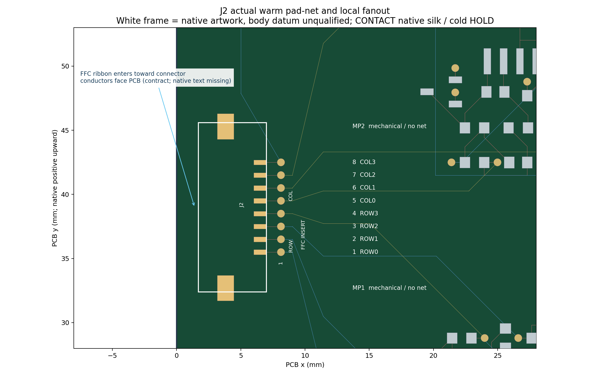

# Pro20: J2 FFC/FPC warm implementation, cold closure blocked

[Complete receipt](COMPLETE_FFC_CORRECTION_RECEIPT.md) · [Final evidence](FINAL_EVIDENCE_AUDIT.json) · [Gates](GATES.json) · [Budget](EXECUTION_BUDGET.json).

User wants an 8-core thin ribbon ZIF slot. Warm actual 176/552/514/107/36+2 mechanical, DRC0. Cold qualification and safe native epro2 export failed; CONTACT-side native text missing, legacy library/3D metadata remains. Review evidence only, PCB_REVIEW_READY=false. No manufacturing/powerup.

[Connector spec](J2_FFC_FPC_CONNECTOR_SPEC.md) · [Cable spec](J2_FFC_CABLE_SPEC.md) · [Pinout/orientation](J2_PINOUT_AND_ORIENTATION.md) · [Actual 10 pads](J2_ACTUAL_SIGNAL_AND_MECHANICAL_PADS.csv) · [Fab contract](FABRICATION_INPUT_CONTRACT.md) · [Open items](MANUFACTURING_OPEN_ITEMS.md) · [Failure/next scope](CLOSURE_FAILURE_AND_NEXT_SCOPE.md) · [Official sources](OFFICIAL_SOURCE_INDEX.json).

Images reconstructed from warm native source, not 3D or cold evidence. Local .eprj2 account database excluded from public files; full third-party documents excluded, official links+SHA retained. Native work file preserved locally without modification.
