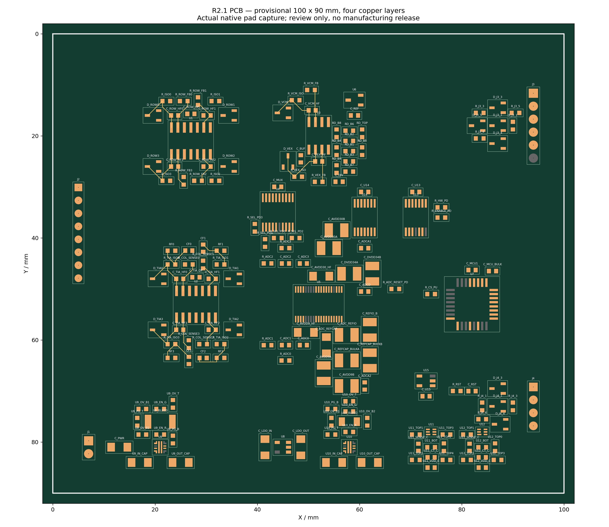
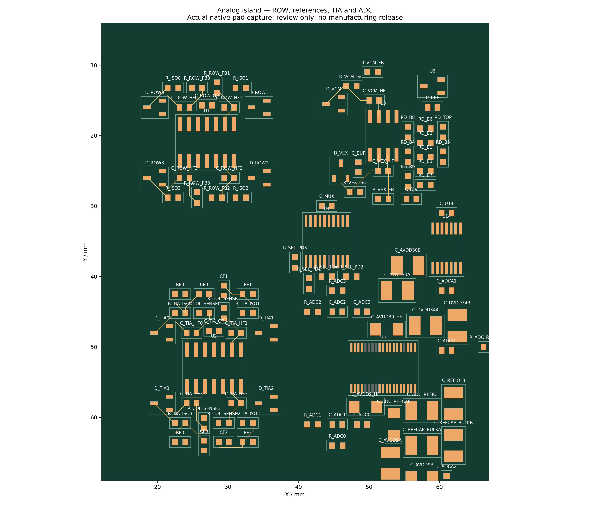

# R2.1 PCB floorplan and local routes — blocked review only

[Complete receipt](COMPLETE_PCB_RECEIPT.md), [rules/floorplan](PCB_RULES_AND_FLOORPLAN.md), [failure/control receipt](FAILURE_AND_CONTROL_RECEIPT.md), [actual550pad CSV](ACTUAL_550_PADS.csv), [BOM/placement](PCB_BOM_AND_PLACEMENT.csv), [107members](ACTUAL_107_NET_MEMBERS.json), [native detailedDRC](FINAL_DRC_DETAILS.csv), [DRCsummary](FINAL_DRC_SUMMARY.json), [gates](GATES.json), [budget](EXECUTION_BUDGET.json), [warm/cold](WARM_COLD_COMPARE.json).

Nativeepro2 andeprj2 are **BLOCKED_NOT_FOR_MANUFACTURE_OR_POWERUP**. 514typedassignments/36NCpass do notconstitutenativecompilercomparisonPASS. Fullrouting is incomplete. No order, manufacturing orpowerup.

AlloriginalCLIrecords/actualFiles/source/failedresults retained. No LFS pointers; independentreadable exports plusfull originals.
